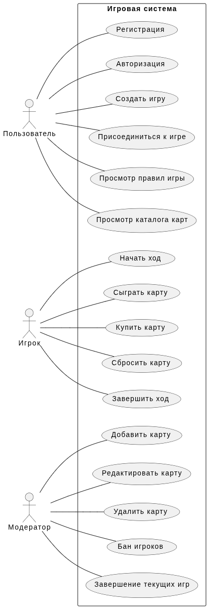
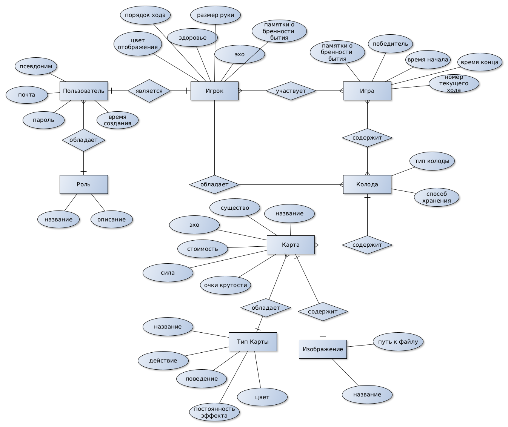
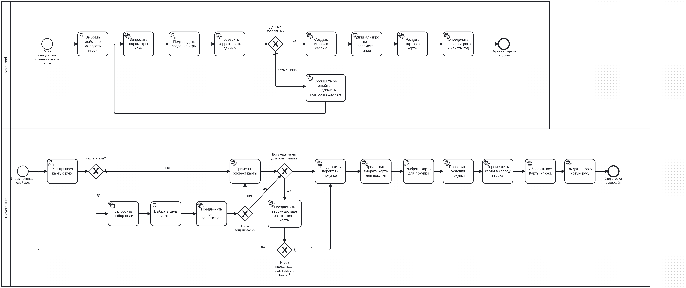
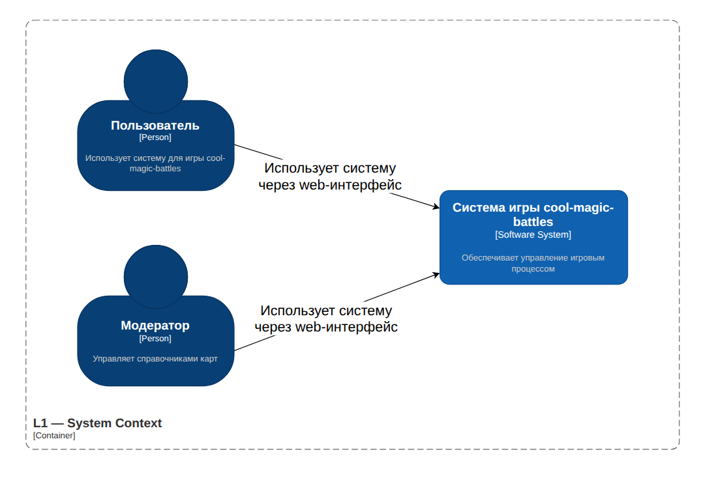
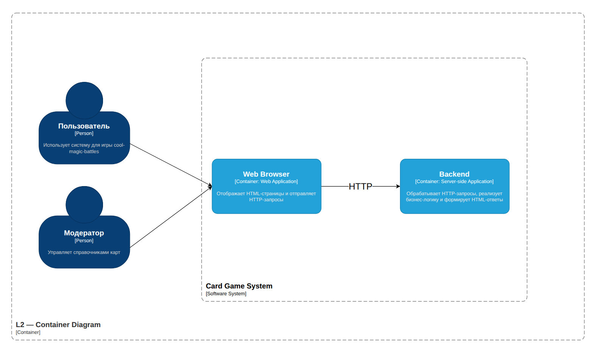
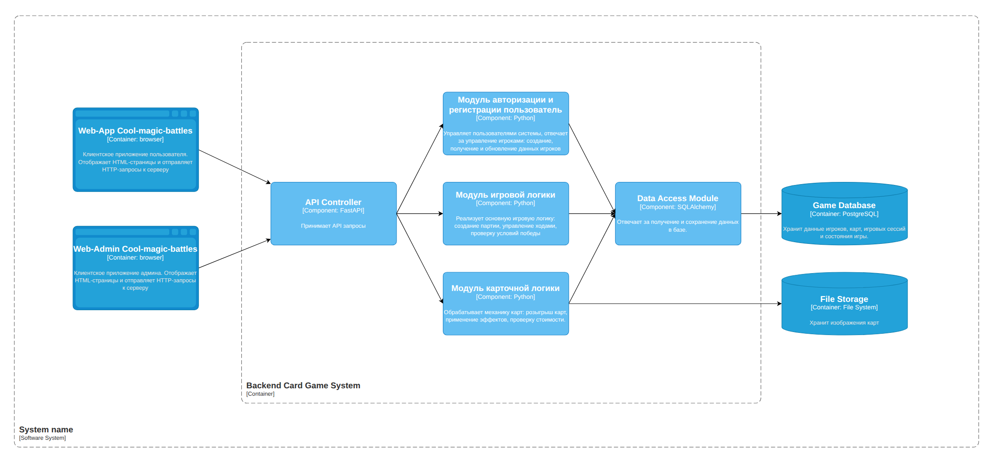
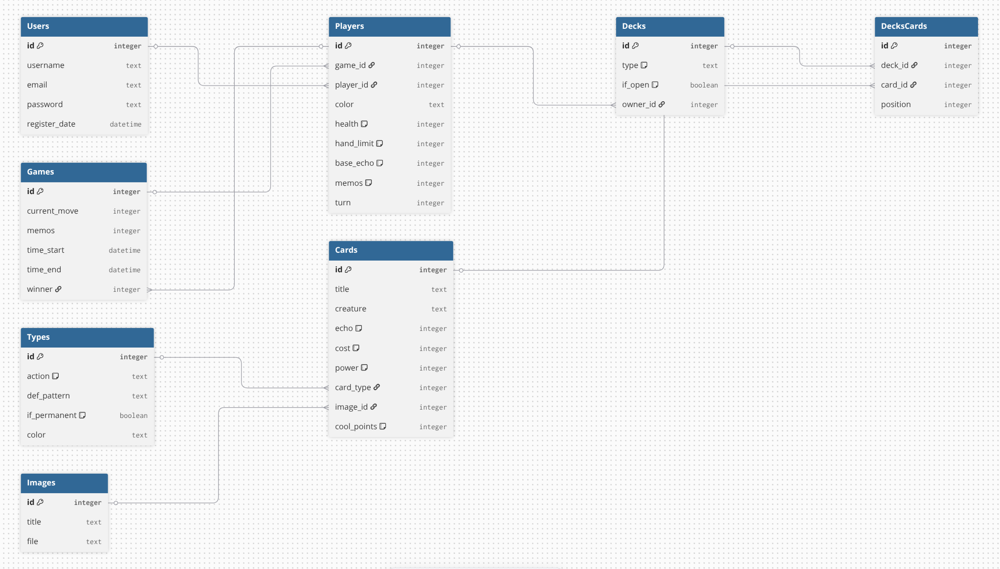

# Крутые магические битвы
**Проект** представляет собой компьютерную реализацию настольной колодостроительной игры "Эпичные схватки боевых магов: Крутагидон". Крутые магические битвы сохраняют механики битв, накопления мощи и карт оригинальной игры.

**Предметной областью проекта** является цифровая реализация карточной колодостроительной игры. В рамках системы игроки участвуют в игровых сессиях, используют карты различных типов (атака, защита, добор, исцеление, ручность, мощность), приобретают новые карты из общего банка и взаимодействуют друг с другом посредством игровых действий. 
> Основными сущностями предметной области являются:
> * пользователи;
> * ировые партии;
> * игроки в партии;
> * карты;
> * колоды игроков;
> * рынки карты;
> * игровые действия. изображение карты.

| Решение              | Онлайн мультиплеер | Колодостроение | Открытая система карт |
| -------------------- | ------------------ | -------------- | --------------------- |
| Tabletop Simulator   | ✔                  | ✔              | ✔                     |
| Hearthstone          | ✔                  | ✖              | ✖                     |
| Dominion Online      | ✔                  | ✔              | ✖                     |
| Предлагаемая система | ✔                  | ✔              | ✔                     |
   
**Актуальность** проекта заключается в том, что настольная игра пользуется популярностью, но не всегда есть возможность разложить карты и полноценно сыграть. Компьютерная версия дает возможность играть "на коленке" без привязки к столу или колоде.

## Роли (акторы)
* **Неавторизованный пользователь (гость)** --- может зарегистрироваться, просматривать текущие игры.

* **Игрок (авторизованный пользователь)** --- может создать игру или присоединиться к уже созданной, выполнять ходы в игре.

* **Модератор** --- может банить пользователей, может изменять состав используемых игровых колод.

> [png](img/actors.png) / [graphml](docs/actors.graphml) / [puml](docs/actors.puml)

## ER-модель

> [png](img/er.png) / [graphml](docs/er.graphml) / [puml](docs/chen.puml)

## Пользовательские сценарии
  - Начало игры:
    - Пользователь заходит в систему
    - Пользователь выбирает "Создать игру"
    - Система создает новую игровую сессию
    - Пользователь становится первым игроком в сессии
    - Система ожидает присоединения остальных игроков
  - Покупка карты:
    - Игрок получает на руку карты
    - Игрок разыгрывает карты с руки в произвольном порядке в любом количестве
    - Система подсчитывает мощь, накопленную игроком за разыгранные карты
    - Пользователь решает купить карты, выбирает из банка карту для покупки
    - Система проверяет, что мощи игрока хватает для покупки карты
    - Если хватает, карта удаляется из банка и добавляется в колоду сброса игрока 
  - Атака и защита:
    - Игрок 1 разыгрывает в свой ход карту атаки
    - Игрок 1 выбирает атаковать игрока 2
    - Игрок 2 может вне своего хода сыграть карту защиты от атаки
    - Если игрок 2 не играет защиту, то атака проходит, игрок 2 теряет очки здоровья
  - Смерть игрока
    - Игрок 1 разыгрывает в свой ход карту атаки на 15 очков здоровья
    - Система предлагает Игроку 2 защититься
    - Игрок 2 отказывается от защиты (либо не имеет карт защиты)
    - Система проверяет оставшееся количество ОЗ Игрока 2 (7 ОЗ); так как здоровья осталось меньше, чем наносимый урон, то Игрок 2 умирает на этом ходу
    - Система регистрирует смерть Игрока 2, начисляет ему "памятку о бренности бытия", отмечающую смерть в игре, после этого устанавливает количество ОЗ Игрока 2 в дефолтное значение
    - Система проверяет, остались ли не присужденные никому памятки о бренности бытия. Если остались, то игра продолжается, иначе игра заканчивается
  - Победа в игре
    - Система регистрирует последнюю игрокую смерть (все памятки присуждены игрокам)
    - Проводится подсчет набранных очков крутости (или же победным очкам игры) для каждого игрока (по "очкам крутости" каждой карты в колоде игрока и по количеству памяток о бренности бытия, присужденных игроку)
    - Игрок, набравший больше всего очков крутости, объявляется победителем игры
    - В случае ничьи по очкам крутости, побеждает игрок с наибольшим количеством купленных карт
    - В случае ничьи по очкам крутости и количеству купленных карт, побеждает игрок с наибольшим количестом карт случайно выбранного типа
    - Если опять ничья, то победитель определяется путем сражения между игроками (например, камнь-ножницы-бумага или дуэль на мечах)
   
## BPMN (draft)

> [png](img/bpmn.png)

# Реализация
**Тип приложения**: MPA  

**Технологический стек**:
- Язык: Python 3.11
- Фреймворк: FastAPI
- База данных: PostgreSQL
- ORNM: SQLAlchemy
- Типизация: mypy
- Линтер: ruff

## L1 и L2 нотация С4

> [png](img/L1C4.png) / [drawio-C4](docs/C4.drawio)

> [png](img/L2C4.png) / [drawio-C4](docs/C4.drawio)

## L3 нотация С4

> [png](img/L3C4.png) / [drawio-C4](docs/C4.drawio)

<!--
## L4 нотация С4

> [png](img/L4C4.png) / [drawio-C4](docs/C4.drawio)
-->
## Диаграммы последовательностей в нотации UML для подготовленных в предыдущей ЛР BPMN-диаграмм

## Диаграмма БД с учетом выбранной СУБД в нотации DBML

> [png](img/dbml.png) / [dbml](docs/db-diagram.dbml)