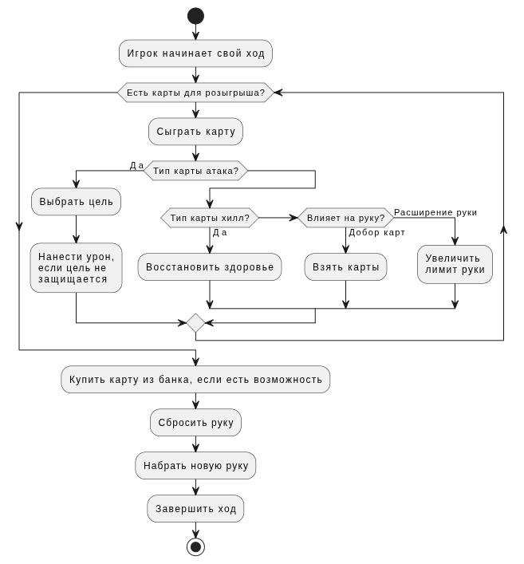

# Крутые магические битвы
**Проект** представляет собой компьютерную реализацию настольной колодостроительной игры "Эпичные схватки боевых магов: Крутагидон". Крутые магические битвы сохраняют механики битв, накопления мощи и карт оригинальной игры.

**Предметной областью проекта** является цифровая реализация карточной колодостроительной игры. В рамках системы игроки участвуют в игровых сессиях, используют карты различных типов (атака, защита, добор, исцеление, ручность, мощность), приобретают новые карты из общего банка и взаимодействуют друг с другом посредством игровых действий. 
> Основными сущностями предметной области являются:
> * пользователи;
> * ировые партии;
> * игроки в партии;
> * карты;
> * колоды игроков;
> * рынки карты;
> * игровые действия. изображение карты.

| Решение              | Онлайн мультиплеер | Колодостроение | Открытая система карт |
| -------------------- | ------------------ | -------------- | --------------------- |
| Tabletop Simulator   | ✔                  | ✔              | ✔                     |
| Hearthstone          | ✔                  | ✖              | ✖                     |
| Dominion Online      | ✔                  | ✔              | ✖                     |
| Предлагаемая система | ✔                  | ✔              | ✔                     |
   
**Актуальность** проекта заключается в том, что настольная игра пользуется популярностью, но не всегда есть возможность разложить карты и полноценно сыграть. Компьютерная версия дает возможность играть "на коленке" без привязки к столу или колоде.

## Роли (акторы)
* **Неавторизованный пользователь (гость)** --- может зарегистрироваться, просматривать текущие игры.

* **Игрок (авторизованный пользователь)** --- может создать игру или присоединиться к уже созданной, выполнять ходы в игре.

* **Модератор** --- может банить пользователей.

* **Мастер** --- может изменять состав используемых игровых колод.

## ER-модель

## Пользовательские сценарии
   - Начало игры:
     - Пользователь заходит в систему
     - Пользователь выбирает "Создать игру"
     - Система создает новую игровую сессию
     - Пользователь становится первым игроком в сессии
     - Система ожидает присоединения остальных игроков
   - Покупка карты:
     - Игрок получает на руку карты
     - Игрок разыгрывает карты с руки в произвольном порядке в любом количестве
     - Система подсчитывает мощь, накопленную игроком за разыгранные карты
     - Пользователь решает купить карты, выбирает из банка карту для покупки
     - Система проверяет, что мощи игрока хватает для покупки карты
     - Если хватает, карта удаляется из банка и добавляется в колоду сброса игрока 
   - Атака и защита:
     - Игрок 1 разыгрывает в свой ход карту атаки
     - Игрок 1 выбирает атаковать игрока 2
     - Игрок 2 может вне своего хода сыграть карту защиты от атаки
     - Если игрок 2 не играет защиту, то атака проходит, игрок 2 теряет очки здоровья
   
## BPMN (draft)
